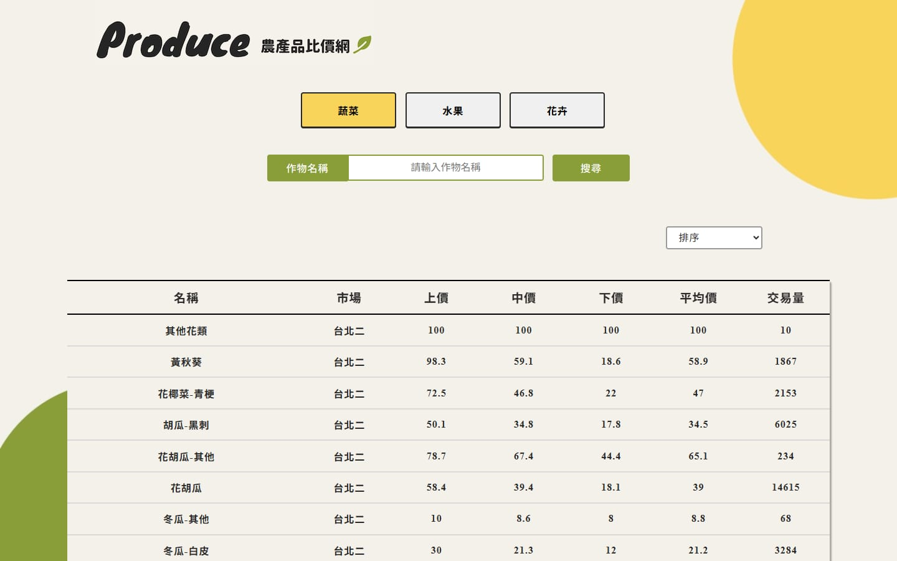

# 農產品比價網

使用原生 JavaScript 串接農產品交易行情 API 並呈現資料表。

[線上 Demo](https://hthoftt.github.io/js-api/)

## 功能
- 依類別篩選:蔬菜、水果、花卉
- 以作物名稱搜尋
- 排序:上價、中價、下價、平均價、交易量
- 資料欄位:名稱、市場、上價、中價、下價、平均價、交易量

<!-- 可再補充:你實際負責或最有成就感的部分 -->

## 使用技術
- HTML
- SCSS
- JavaScript
- Fetch API

## 本機執行
直接用瀏覽器開啟 `index.html`,或在 VS Code 使用 Live Server。

## 作者
洪子祥 · [GitHub](https://github.com/hthoftt) · tonyhung92568@gmail.com
